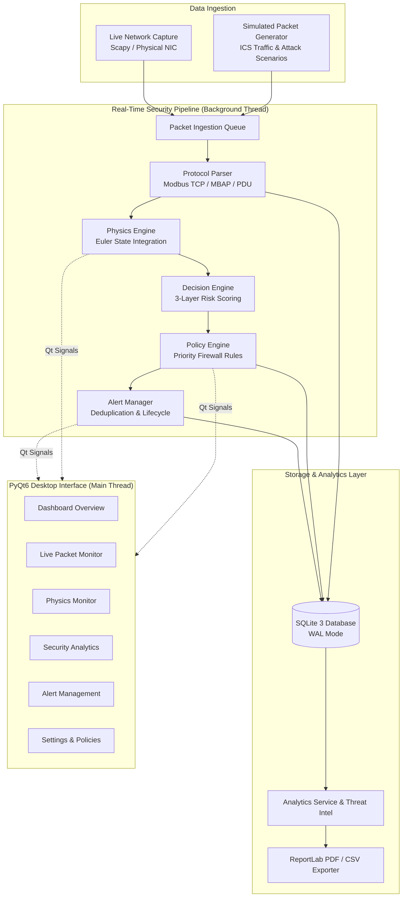

# VoltGuard — Physics-Aware ICS/SCADA Intrusion Detection System

<p align="center">
  
  <br/>
  <strong>⚡ VoltGuard IDS v1.0.0</strong><br/>
  <em>An Offline-First, Physics-Simulation–Driven Intrusion Detection & Firewall System for Industrial Control Networks</em>
</p>

<p align="center">
  
  
  
  
  
  
</p>

---

## 📖 Table of Contents

- [Overview & Problem Statement](#-overview--problem-statement)
- [Key Features](#-key-features)
- [System Architecture](#-system-architecture)
- [Physics Simulation & Mathematical Model](#-physics-simulation--mathematical-model)
- [Three-Layer Decision & Policy Engine](#-three-layer-decision--policy-engine)
- [Project Directory Structure](#-project-directory-structure)
- [Installation & Quick Start](#-installation--quick-start)
- [Running VoltGuard](#-running-voltguard)
- [Dashboard & UI Overview](#-dashboard--ui-overview)
- [Configuration Reference](#-configuration-reference)
- [Testing & Quality Assurance](#-testing--quality-assurance)
- [Security Notice](#-security-notice)
- [Git Workflow: Commit & Push](#-git-workflow-commit--push)
- [License](#-license)

---

## 🌐 Overview & Problem Statement

Industrial Control Systems (ICS) and SCADA networks manage critical infrastructure—such as power grids, water treatment plants, petrochemical refineries, and manufacturing pipelines. The dominant communication protocol in these environments, **Modbus TCP**, was designed decades before cybersecurity was a design criterion. It lacks encryption, session integrity, and authentication.

### The Problem: Syntactically Valid Attacks
In traditional IT security, firewalls and signature-based IDSs inspect packet headers and known payload signatures. However, in an industrial environment:
1. An attacker who breaches the network can issue structurally **valid Modbus TCP write commands**.
2. A command like `Write Single Register (0x06)` instructing a pump to spin at 4,500 RPM (well beyond the 3,600 RPM tolerance limit) is **100% valid Modbus syntax**.
3. Traditional signature-based IDSs will mark this packet as benign, resulting in catastrophic physical damage (e.g., pipe rupture, pump cavitation, Stuxnet-style physical degradation).

### The VoltGuard Solution
**VoltGuard** bridges cyber defense and industrial physics by operating as a **Physics-Aware Intrusion Detection System**. It combines deep protocol decoding with a real-time dynamic simulation of the underlying physical process (water-distribution / pumping system). Before any packet is permitted or audited, VoltGuard simulates its impact on physical state variables (RPM, pressure, flow rate, temperature, tank level). If the commanded action violates safety boundaries or physical feasibility, VoltGuard immediately flags or blocks the packet and generates actionable security alerts.

---

## 🚀 Key Features

- **⚡ Deep Modbus TCP Inspection**:
  - Full Application Data Unit (ADU), MBAP header, and PDU decoding.
  - Complete support for standard function codes:
    - `0x01` Read Coils, `0x02` Read Discrete Inputs
    - `0x03` Read Holding Registers, `0x04` Read Input Registers
    - `0x05` Write Single Coil, `0x06` Write Single Register
    - `0x0F` Write Multiple Coils, `0x10` Write Multiple Registers
  - Structural validation of transaction IDs, protocol IDs, length fields, unit IDs, register address ranges, and payload bounds.

- **🌊 Dynamic Physics Simulation Engine**:
  - Models a multi-stage water-distribution / fluid system with pump dynamics, valve positions, pipe pressures, fluid flow, temperature dissipation, and reservoir level.
  - Numerical state integration via Euler methods ($\Delta t$).
  - Physical constraint checks: cavitation limits, over-pressure thresholds, thermal runaway, and rapid step-change anomaly detection.

- **🛡️ 3-Layer Deterministic Decision Engine**:
  - **Layer 1: Protocol & Network Policy** (IP whitelist/blacklist, CIDR validation, port verification, function code access matrix).
  - **Layer 2: Physical Feasibility & Constraints** (Predictive physics state validation, rate-of-change limits, cross-variable correlation).
  - **Layer 3: Anomaly & Threat Intelligence** (Frequency burst detection, suspicious payload heuristics, known malicious CIDR indicators).

- **⚖️ Priority-Ordered Firewall Policy Engine**:
  - Deterministic evaluation order with explicit priority rankings.
  - Granular matching criteria: Source/Destination IP, CIDR blocks, Modbus function codes, register address ranges, and composite risk levels (`LOW`, `MEDIUM`, `HIGH`, `CRITICAL`).
  - Configurable actions: `ALLOW`, `ALERT`, `BLOCK` with fail-safe defaults.

- **🚨 Intelligent Alert & Incident Lifecycle**:
  - Deterministic SHA-256 fingerprinting with sliding-window deduplication (collapses repeated alarms during attack bursts while incrementing occurrence counters).
  - Severity classification (`INFO`, `LOW`, `MEDIUM`, `HIGH`, `CRITICAL`).
  - Alert acknowledge, resolve, and audit tracking backed by SQLite persistence.

- **📊 Modern PyQt6 Desktop Dashboard**:
  - Offline-first desktop application with 6 dedicated views:
    1. **Overview Dashboard**: System KPI cards, real-time gauges, threat breakdown, and live event feed.
    2. **Live Packet Monitor**: Deep packet inspection table, full protocol decoder, payload inspector, and hex view.
    3. **Physics Monitor**: Real-time process visualizers, gauge clusters (RPM, Pressure, Flow, Temp, Level), and history plots.
    4. **Security Analytics**: Incident timeline, function code distributions, top talkers, threat intelligence matrix.
    5. **Alert Management**: Real-time alert list, filter by severity/status, one-click acknowledge/resolve workflows.
    6. **Reports & Settings**: PDF forensic report generation via ReportLab, CSV exports, policy editor, and threshold tuning.

- **📄 Automated Forensic Report Generation**:
  - Generates comprehensive PDF audit reports summarizing packet throughput, security incidents, policy enforcement distribution, and physical stability metrics.

---

## 🏗️ System Architecture

VoltGuard is built upon a modular, decoupled MVC architecture with a real-time background packet processing pipeline.



---

## 📐 Physics Simulation & Mathematical Model

VoltGuard simulates a continuous physical process (water pumping & distribution station) to validate that incoming control commands will not drive the physical equipment into a destructive state.

### State Vector $\mathbf{x}(t)$
$$\mathbf{x}(t) = \begin{bmatrix} \omega(t) \\ P(t) \\ Q(t) \\ T(t) \\ V(t) \end{bmatrix} = \begin{bmatrix} \text{Pump RPM} \\ \text{Pipeline Pressure (bar)} \\ \text{Flow Rate (L/s)} \\ \text{Process Temperature } (^\circ\text{C}) \\ \text{Reservoir Level (\%)} \end{bmatrix}$$

### Governing Equations (Euler Discrete Integration)
1. **Pump RPM Dynamics**:
   $$\omega(t + \Delta t) = \omega(t) + \frac{1}{\tau_{\omega}} \left(\omega_{\text{target}} - \omega(t)\right) \Delta t$$
2. **Pipeline Pressure**:
   $$P(t + \Delta t) = P(t) + \left(k_p \cdot \left(\frac{\omega(t)}{\omega_{\text{max}}}\right)^2 - k_{\text{loss}} \cdot Q(t) - P(t)\right) \frac{\Delta t}{\tau_p}$$
3. **Flow Rate**:
   $$Q(t + \Delta t) = \kappa \cdot \sqrt{|P(t)|} \cdot \theta_{\text{valve}}$$
4. **Temperature Dissipation**:
   $$T(t + \Delta t) = T(t) + \left(\alpha \cdot \omega(t)^2 - \beta \cdot Q(t) \cdot (T(t) - T_{\text{ambient}})\right) \Delta t$$

### Safety Envelope Thresholds
| Variable | Safe Range | Warning Range | Critical / Action Threshold |
|---|---|---|---|
| **Pump Speed** | $0 - 3,000\text{ RPM}$ | $3,001 - 3,599\text{ RPM}$ | $\ge 3,600\text{ RPM}$ (Mechanical failure) |
| **Pressure** | $1.0 - 6.0\text{ bar}$ | $6.1 - 8.9\text{ bar}$ | $\ge 9.0\text{ bar}$ (Pipe over-pressure) |
| **Flow Rate** | $5.0 - 40.0\text{ L/s}$ | $40.1 - 49.9\text{ L/s}$ | $\ge 50.0\text{ L/s}$ (Burst pipe) |
| **Temperature** | $20.0 - 65.0\text{ }^\circ\text{C}$ | $65.1 - 84.9\text{ }^\circ\text{C}$ | $\ge 85.0\text{ }^\circ\text{C}$ (Thermal runaway) |
| **Tank Level** | $15.0 - 85.0\%$ | $5.0 - 14.9\%$ / $85.1 - 94.9\%$ | $< 5.0\%$ (Dry run) / $\ge 95.0\%$ (Overflow) |

---

## 🛡️ Three-Layer Decision & Policy Engine

Every decoded industrial packet passes through three deterministic evaluation layers:

```
                  ┌─────────────────────────────────────┐
                  │       Incoming Parsed Packet        │
                  └──────────────────┬──────────────────┘
                                     │
                                     ▼
                  ┌─────────────────────────────────────┐
                  │    Layer 1: Protocol & Network      │
                  │    - Valid Modbus PDU bounds        │
                  │    - IP & Port Whitelist / Blacklist│
                  │    - Authorized Function Codes      │
                  └──────────────────┬──────────────────┘
                                     │
                                     ▼
                  ┌─────────────────────────────────────┐
                  │    Layer 2: Physics Verification    │
                  │    - Predict outcome with Euler Sim │
                  │    - Check Physical Safety Limits   │
                  │    - Verify State Step Rate Limits  │
                  └──────────────────┬──────────────────┘
                                     │
                                     ▼
                  ┌─────────────────────────────────────┐
                  │    Layer 3: Anomaly & Intel         │
                  │    - Command frequency rate checks  │
                  │    - Known Threat Intel CIDR match  │
                  │    - Sequence anomaly evaluation    │
                  └──────────────────┬──────────────────┘
                                     │
                                     ▼
                  ┌─────────────────────────────────────┐
                  │     Composite Risk Score (0.0–1.0)  │
                  │     0.0-0.2: LOW  | 0.2-0.5: MED    │
                  │     0.5-0.8: HIGH | 0.8-1.0: CRIT   │
                  └──────────────────┬──────────────────┘
                                     │
                                     ▼
                  ┌─────────────────────────────────────┐
                  │      Firewall Policy Engine         │
                  │      Priority Ordered Rules         │
                  │  Action: [ ALLOW | ALERT | BLOCK ]  │
                  └─────────────────────────────────────┘
```

---

## 📁 Project Directory Structure

```
voltguard-ics-firewall/
├── src/                                ← Core Application Source Code
│   ├── main.py                         ← Application bootstrap & PyQt6 entry point
│   ├── config.py                       ← Dynamic JSON + environment config manager
│   ├── constants.py                    ← Global enumerations, limits, and defaults
│   ├── exceptions.py                   ← Custom typed exception hierarchy
│   ├── logger.py                       ← Rotating multi-sink logging engine
│   ├── healthcheck.py                  ← System pre-flight diagnostic checker
│   ├── startup.py                      ← Startup sequence & CLI banner
│   ├── utils.py                        ← Cryptographic, network, and formatting utils
│   │
│   ├── capture/                        ← Packet Ingestion & Capture Drivers
│   │   ├── live_source.py              ← Scapy live interface sniffer
│   │   └── simulation_source.py        ← Deterministic ICS traffic & attack generator
│   │
│   ├── core/                           ← Core State & Event Bus
│   │   └── app_state.py                ← Thread-safe application state manager
│   │
│   ├── database/                       ← SQLite Database & Migrations
│   │   └── db_manager.py               ← WAL-mode SQLite schema, connections & indexes
│   │
│   ├── interfaces/                     ← Abstract Base Classes (Contracts)
│   │   ├── base_parser.py              ← BaseParser & ParsedPacket DTO
│   │   ├── base_physics.py             ← BasePhysicsEngine & PhysicsState DTO
│   │   └── base_engine.py              ← BaseDecisionEngine & DecisionResult DTO
│   │
│   ├── models/                         ← Typed Data Models
│   │   └── app_models.py               ← PacketLog, Alert, SecurityEvent, Rule models
│   │
│   ├── parser/                         ← Industrial Protocol Parsers
│   │   ├── modbus_parser.py            ← Modbus TCP / MBAP / PDU decoder
│   │   └── packet_generator.py         ← Synthetically valid & anomalous packet maker
│   │
│   ├── physics/                        ← Physical Process Simulation
│   │   ├── water_system_engine.py      ← Water plant Euler physics differential solver
│   │   └── safety_monitor.py           ← Physics safety invariants & bounds validator
│   │
│   ├── decision_engine/                ← Risk Evaluation & Decision Engine
│   │   └── decision_engine.py          ← 3-layer deterministic security evaluator
│   │
│   ├── policy/                         ← Priority Firewall Policy Engine
│   │   ├── policy_engine.py            ← Policy matcher (IP, CIDR, FC, Risk)
│   │   ├── policy_config.py            ← Policy loader & serializer
│   │   └── simulation_adapter.py       ← Policy enforcement simulation adapter
│   │
│   ├── pipeline/                       ← Real-time Asynchronous Pipeline
│   │   ├── packet_pipeline.py          ← Background thread packet processing queue
│   │   └── alert_manager.py            ← Sliding-window deduplication & alert lifecycle
│   │
│   ├── services/                       ← Business Logic & Infrastructure Services
│   │   ├── config_service.py           ← Configuration persistence
│   │   ├── database_service.py         ← SQLite CRUD repository
│   │   ├── logging_service.py          ← Qt-compatible log dispatcher
│   │   ├── theme_service.py            ← Dark/light GUI styling engine
│   │   ├── security_analytics_service.py ← Threat intelligence & incident analytics
│   │   └── report_service.py           ← ReportLab PDF & CSV forensic exporter
│   │
│   └── ui/                             ← PyQt6 Desktop User Interface
│       ├── main_window.py              ← Main frame, responsive sidebar & navigation
│       ├── sidebar.py                  ← Custom animated sidebar widget
│       └── pages/                      ← Application views
│           ├── dashboard_page.py       ← Real-time overview KPI dashboard
│           ├── packet_monitor_page.py  ← Live packet stream & hex inspector
│           ├── physics_monitor_page.py ← Physical process gauges & live graphs
│           ├── analytics_page.py       ← Security analytics & threat intelligence
│           ├── reports_page.py         ← Incident alerts & report generator
│           └── settings_page.py        ← Firewall rules & physical parameter tuning
│
├── tests/                              ← Comprehensive Test Suite (579 Tests)
│   ├── test_day1.py                    ← Architecture & foundational models
│   ├── test_day2_parser.py             ← Modbus TCP protocol parser tests
│   ├── test_day3_physics.py            ← Physics engine differential equations
│   ├── test_day4_decision.py           ← 3-layer decision engine evaluation
│   ├── test_day5_pipeline.py           ← Background pipeline & queue throughput
│   ├── test_day6_policy.py             ← Firewall policy matching & priority order
│   ├── test_day7_alerts.py             ← Alert deduplication & lifecycle tracking
│   ├── test_day8_analytics.py          ← Analytics service & threat intel
│   └── test_physics_safety_monitor.py  ← Physical safety boundary assertions
│
├── docs/                               ← Documentation & Academic Report
│   └── PROJECT_REPORT.md               ← Complete project documentation & analysis
│
├── assets/                             ← Visual assets & icon packs
├── reports/                            ← Auto-generated PDF / CSV reports directory
├── logs/                               ← Application runtime logs (auto-generated)
├── config.json                         ← Runtime configuration file
├── requirements.txt                    ← Python dependencies
└── .gitignore                          ← Git ignore configuration
```

---

## 💻 Installation & Quick Start

### Prerequisites
- **Python 3.10** or higher
- **macOS / Linux / Windows**

### 1. Clone the Repository
```bash
git clone https://github.com/parthu0030/voltguard-ics-firewall.git
cd voltguard-ics-firewall
```

### 2. Create and Activate Virtual Environment
```bash
# macOS / Linux
python3 -m venv .venv
source .venv/bin/activate

# Windows (Command Prompt / PowerShell)
# python -m venv .venv
# .venv\Scripts\activate
```

### 3. Install Dependencies
```bash
pip install --upgrade pip
pip install -r requirements.txt
```

---

## 🎮 Running VoltGuard

### Launch the Desktop GUI
```bash
python3 -m src.main
```

### Run the System Diagnostic Health Check
```bash
python3 -c "from src.healthcheck import HealthChecker; HealthChecker().print_report()"
```

### Run the Headless Startup Sequence (CLI / CI Mode)
```bash
python3 -c "from src.startup import run_startup_sequence; run_startup_sequence()"
```

---

## 🖥️ Dashboard & UI Overview

VoltGuard features a custom **PyQt6 dark-mode interface** tailored for SCADA security analysts:

| View | Key Functionality |
|---|---|
| **📊 Overview Dashboard** | Displays live packet throughput, active alert counts, physical health gauges, and recent threat events. |
| **🔍 Packet Monitor** | Real-time packet table with Modbus function decoding, transaction IDs, register offsets, and raw payload hex viewer. |
| **⚙️ Physics Monitor** | Multi-gauge cluster visualizing pump RPM, pipeline pressure, flow rate, temperature, and fluid level with historical charts. |
| **📈 Security Analytics** | Interactive threat matrices, Modbus function code distribution, top attacking IPs, and risk trend metrics. |
| **🚨 Alert & Incident Center** | Deduplicated security alarms, severity filtering (`LOW` to `CRITICAL`), and one-click incident acknowledgement. |
| **📑 Reports & Settings** | One-click PDF forensic report generation via ReportLab, CSV export, firewall policy configuration, and physics threshold tuning. |

---

## ⚙️ Configuration Reference

VoltGuard creates `config.json` on first run with safe defaults:

```json
{
  "app_version": "1.0.0",
  "log_level": "INFO",
  "selected_interface": "lo0",
  "theme": "dark",
  "db_path": "voltguard.db",
  "physics": {
    "pressure_max_bar": 10.0,
    "flow_max_lps": 50.0,
    "temp_max_celsius": 150.0,
    "rpm_max": 3600.0,
    "tank_capacity_liters": 10000.0
  },
  "deduplication_window_seconds": 10.0
}
```

### Environment Variable Overrides
Any setting can be overridden at runtime using the `VOLTGUARD_` prefix:
```bash
VOLTGUARD_LOG_LEVEL=DEBUG VOLTGUARD_THEME=dark python3 -m src.main
```

---

## 🧪 Testing & Quality Assurance

VoltGuard includes a comprehensive automated test suite consisting of **579 unit, integration, and property-based tests**:

```bash
# Run the complete test suite
pytest -v

# Run with coverage report
pytest --cov=src -v
```

### Test Suite Distribution
- ✅ `test_day1.py`: Configuration, database migrations, state singletons, exception tree (107 tests)
- ✅ `test_day2_parser.py`: Modbus TCP ADU / MBAP / PDU byte decoding & edge cases (70 tests)
- ✅ `test_day3_physics.py`: Euler integration, water plant differential state models (64 tests)
- ✅ `test_day4_decision.py`: 3-layer deterministic decision engine & risk formulas (78 tests)
- ✅ `test_day5_pipeline.py`: Asynchronous queue throughput, thread lifecycle, backpressure (52 tests)
- ✅ `test_day6_policy.py`: Firewall policy precedence, CIDR resolution, fallback matching (82 tests)
- ✅ `test_day7_alerts.py`: Sliding-window deduplication, SQLite persistence, lifecycle (56 tests)
- ✅ `test_day8_analytics.py`: Threat intelligence provider, statistics aggregation, PDF export (67 tests)
- ✅ `test_physics_safety_monitor.py`: Dynamic invariant violations & pump cavitation detection (3 tests)

**Result: 579 Passed, 0 Failures (100% Pass Rate)**

---

## 🔒 Security Notice

- VoltGuard operates primarily as a **real-time detection, physics validation, and alerting** system.
- OS-level packet dropping (e.g., active Linux `nftables`/`iptables` hook) is managed through simulated firewall policy adapters and logged for forensic auditing.
- For live packet capture on physical network interfaces, administrative privileges (`sudo` on Linux/macOS) may be required by libpcap/Scapy.

---

## 🚀 Git Workflow: Commit & Push

Follow these steps to commit your latest changes and push them to your GitHub repository:

```bash
# 1. Verify working tree status
git status

# 2. Stage all modified and new files (untracked temp and db files are ignored via .gitignore)
git add .

# 3. Commit with a descriptive message
git commit -m "docs: update comprehensive project README with physics engine, architecture, and test suite details"

# 4. Push to your remote repository on the main branch
git push origin main
```

*(If you are working on a feature branch, replace `main` with your branch name, e.g., `git push origin <your-branch-name>`)*

---

## 📄 License

This project is licensed under the **MIT License** — see the [LICENSE](LICENSE) file for details.
